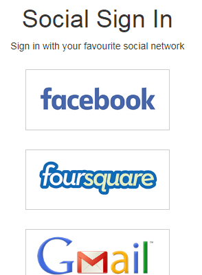

# ZF-Three-Social-Auth
Social Sign-in and registration for Zend Framework 3 Web Applications.

## Dependencies
This example is based on the Userdemo at https://github.com/olegkrivtsov/using-zf3-book-samples/tree/master/userdemo and you need to install that project before starting ZF-Three-Social-Auth. 

You can use ZF-Three-Social-Auth with any Zend Framework 3 project even if it is not based on the Userdemo but you will need an alternative way of authenticating users and authorising access to the various pages of your application. 

## Requirements
**PHP 7**: Since most of the factories have **Return Type Declarations**, the code as it now stands can only be used with PHP version 7 and higher. You could remove these return type declarations to work with PHP 5.6 and higher.